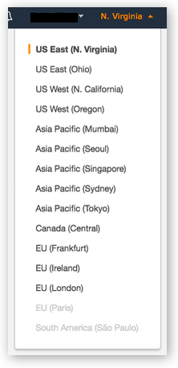
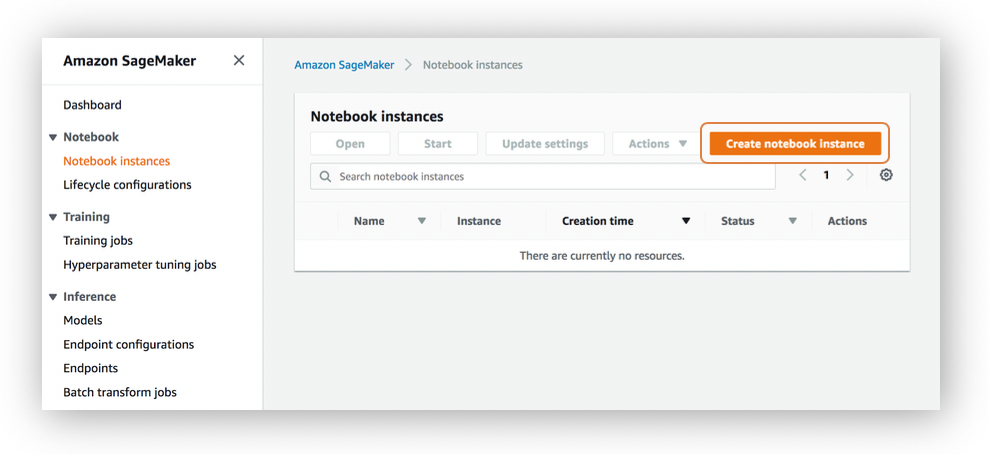
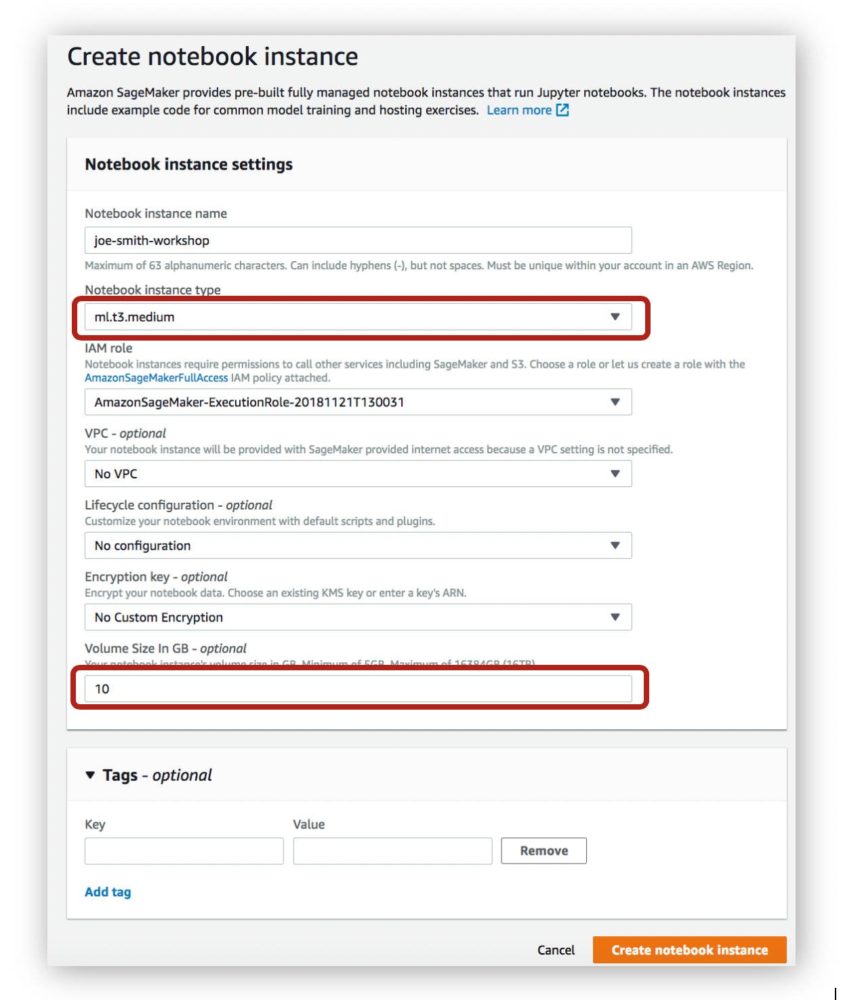
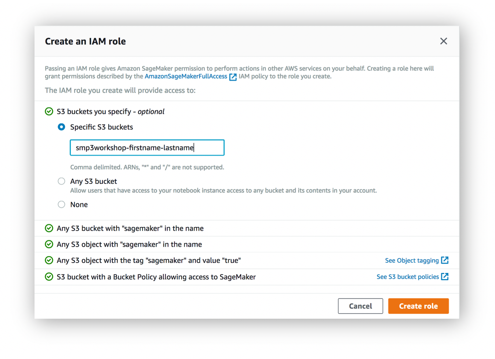
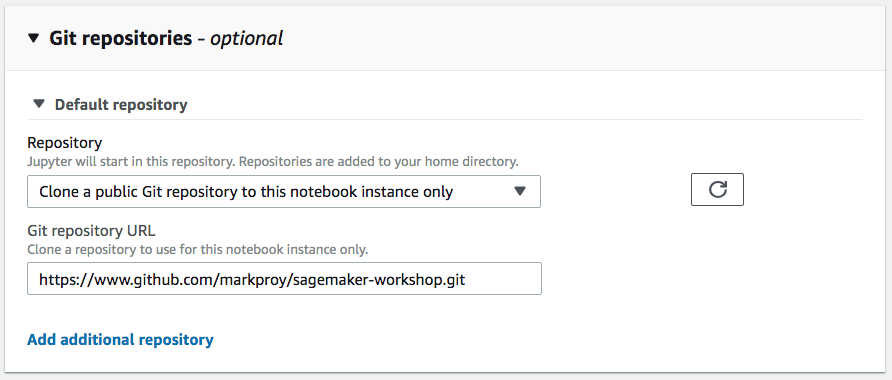

# Amazon SageMaker Workshop

Amazon SageMaker is a fully-managed service that enables developers and data scientists to quickly and easily build, train, and deploy machine learning models at any scale. In this workshop, you'll create a SageMaker notebook instance and work through sample Jupyter notebooks that demonstrate some of the many features of SageMaker.    

## Prerequisites

### AWS Account

In order to complete this workshop you'll need an AWS Account with access to create AWS IAM, S3, and SageMaker resources. If you do not have an AWS Account, please follow the [instructions here](https://aws.amazon.com/premiumsupport/knowledge-center/create-and-activate-aws-account/) to create an AWS Account.

The code and instructions in this workshop assume only one student is using a given AWS account at a time. If you try sharing an account with another student, you'll run into naming conflicts for certain resources. You can work around these by appending a unique suffix to the resources that fail to create due to conflicts, but the instructions do not provide details on the changes required to make this work.

If you are provided with AWS credit for this workshop, use this [link](https://console.aws.amazon.com/billing/home?#/credits) to apply the credit to your AWS Account.

### AWS Region

SageMaker is not available in all AWS Regions at this time.  Accordingly, we recommend running this workshop in one of the supported AWS Regions such as N. Virginia, Oregon, Ohio.

Please confirm whether there is a recommended region for your workshop by consulting your workshop leader.

**Once you've chosen a region, you should create all of the resources for this workshop there, including a new Amazon S3 bucket and a new SageMaker notebook instance. Make sure you select your region from the dropdown in the upper right corner of the AWS Console before getting started.**

### Browser

We recommend you use the latest version of Chrome or Firefox to complete this workshop.

## Labs

This workshop is divided into multiple labs. Lab 0 must be completed first. You can complete the other
labs in any order. The focus of this lab is to create your first notebook instance.

Be patient as you work your way through the notebook-based labs. After you run a cell in a notebook, it may take several seconds for the code to show results. For the cells that start training jobs, it may take 10 to 30 minutes.

After you have completed the workshop, you can delete all of the resources that were created by following the Cleanup Guide provided with this lab guide.

## Creating a Notebook Instance

In this section, we'll start by creating an Amazon S3 bucket that will be used throughout the workshop.  We'll then create an Amazon SageMaker notebook instance, which we will use to run the other workshop labs.

### 1. Create a S3 Bucket

SageMaker typically uses S3 as storage for data and model artifacts.  In this step you'll create a S3 bucket for this purpose. To begin, sign into the AWS Management Console, https://console.aws.amazon.com/.

#### High-Level Instructions

Use the console or AWS CLI to create an Amazon S3 bucket. Keep in mind that your bucket's name must be globally unique across all regions and customers. We recommend using a name like `smworkshop-firstname-lastname`. If you get an error that your bucket name already exists, try adding additional numbers or characters until you find an unused name.

<strong>Step-by-step instructions (expand for details)</strong>

1. In the AWS Management Console, choose **Services** then select **S3** under Storage.

1. Choose **+Create Bucket**

1. Provide a globally unique name for your bucket such as `smworkshop-firstname-lastname`.

1. Select the Region you've chosen to use for this workshop from the dropdown.

1. Choose **Create** in the lower left of the dialog without selecting a bucket to copy settings from.

### 2. Launching the Notebook Instance

1. In the upper-right corner of the AWS Management Console, confirm you are in the desired AWS region. Select N. Virginia, Oregon, Ohio.

2. Click on Amazon SageMaker from the list of all services.  This will bring you to the Amazon SageMaker console homepage.

3. To create a new notebook instance, go to **Notebook instances**, and click the **Create notebook instance** button at the top of the browser window.

4. Type [First Name]-[Last Name]-workshop into the **Notebook instance name** text box, and select `ml.c5.xlarge` for the **Notebook instance type**.

5. For IAM role, choose **Create a new role**. On the next screen, select **Specific S3 buckets** for the **S3 buckets you specify - optional** section, enter the name of the S3 bucket you created in the last step, and click **Create role** to continue.

6. Enter **10** for the **Volume Size In GB - optional** instead of the default 5.

7. Instructions for the labs, and some of the Jupyter notebooks for the labs are available in a public  GitHub repo. Expand the `Git repositories` section, choose `Clone a public Git repository to this notebook instance only`. Then for the `Git repository URL`, specify the following: `https://github.com/markproy/sagemaker-workshop.git`.

8. You can expand the `Tags` section and add tags here if required.

9. Click **Create notebook instance**.  This will take several minutes to complete.

### 3. Accessing the Notebook Instance

1. Wait for the server status to change to **InService**. This will take a few minutes.

2. Click **Open Jupyter**. You will now see the Jupyter homepage for your notebook instance.

### 4. Access workshop content

1. For some of the labs, you will use the **SageMaker Examples** tab and locate a lab notebook in one of several groups of notebooks.

2. Click on the **Use** button next to the notebook (e.g., DeepAR-Electricity.ipynb) to download the lab.

3. Click on the **Files** tab and open the new folder created. Click on the jupyter notebook (e.g., DeepAR-Electricity.ipynb) to start the lab.

4. Follow the instructions in the notebook to complete the lab.

## Cleanup Guide

To avoid charges for resources you no longer need when you're done with this workshop, you can delete them or, in the case of your notebook instance, stop them.  Here are the resources you should consider:

- Endpoints:  these are the clusters of one or more instances serving inferences from your models. If you did not delete them from within the notebooks, you can delete them via the SageMaker console.  To do so, click the **Endpoints** link in the left panel.  Then, for each endpoint, click the radio button next to it, then select **Delete** from the **Actions** drop down menu. You can follow a similar procedure to delete the related Models and Endpoint configurations.

- Notebook instance:  you have two options if you do not want to keep the notebook instance running. If you would like to save it for later, you can stop rather than deleting it. To delete it, click the **Notebook instances** link in the left panel. Next, click the radio button next to the notebook instance created for this workshop, then select **Delete** from the **Actions** drop down menu. To simply stop it instead, just click the **Stop** link.  After it is stopped, you can start it again by clicking the **Start** link.  Keep in mind that if you stop rather than deleting it, you will be charged for the storage associated with it.  

## License

The contents of this workshop are licensed under the Apache 2.0 License.
